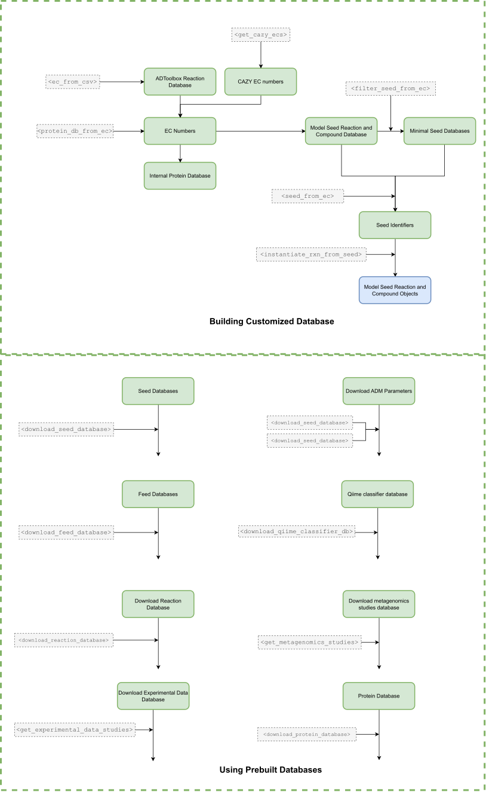
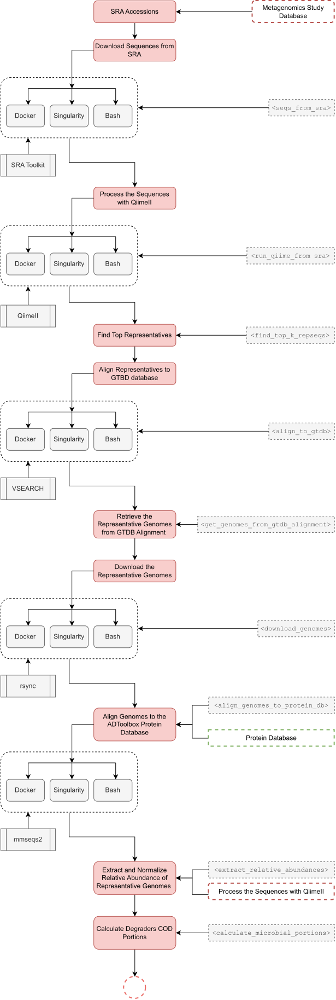
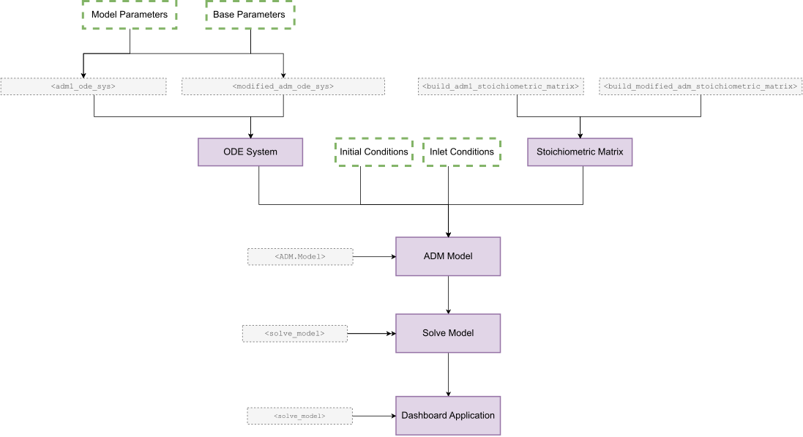

# API

ADToolbox configuration objects derive file paths from the directory that you pass to them. There is no global project or base directory. Objects in the core module can still be instantiated with a matching object from the configs module. For instance, if you want to use the methods of the metagenomics class in core module, you should do the following:

```
from adtoolbox import configs and core

metag_conf=configs.Metagenomics("./my_metagenomics_run", database_dir="./my_database")
metag_object=core.Metagenomics(metag_conf)

```

Doing this makes any core.Metagenomics method use paths under the selected run and database directories. If you want to overwrite a default configuration, pass the desired argument to the configs.Metagenomics constructor. For example, if you want to change the docker repository for VSEARCH
you can:

```

metag_conf=configs.Metagenomics(vsearch_docker="mydocker") 
metag_object=core.Metagenomics(metag_conf)

```

Now when you execute the corresponding method in core.Metagenomics it will use mydocker instead of the defult. To learn more about defult configs, go to the configs api.

## configs

You can access this module by:

```
from adtoolbox import configs 

```
This module contains configurations that are required by other classes in the package and also links to remote databases. The following classes are included in this module:

### 1. Database
::: adtoolbox.configs.Database

### 2. Metagenomics
::: adtoolbox.configs.Metagenomics

### 3. Utils
::: adtoolbox.configs.Utils


## core
You can access this module by:

```
from adtoolbox import core 

```
This module includes the following classes:

### 1. Experiment
::: adtoolbox.core.Experiment

### 2. Feed
::: adtoolbox.core.Feed

### 3. MetegenomicsStudy

::: adtoolbox.core.MetagenomicsStudy

### 4. Reaction

::: adtoolbox.core.Reaction

### 5. Metabolite

::: adtoolbox.core.Metabolite

### 6.SeedDB

::: adtoolbox.core.SeedDB

### 7. Database

Here is a schematic of the Database Module



::: adtoolbox.core.Database

### 8. Metagenomics

Here is a schematic view of core.Metagenomics API:



::: adtoolbox.core.Metagenomics


## adm

Here is a schematic view of adm API:



You can access this module by:

```
from adtoolbox import adm 

```
This module includes the following classes:

::: adtoolbox.adm


