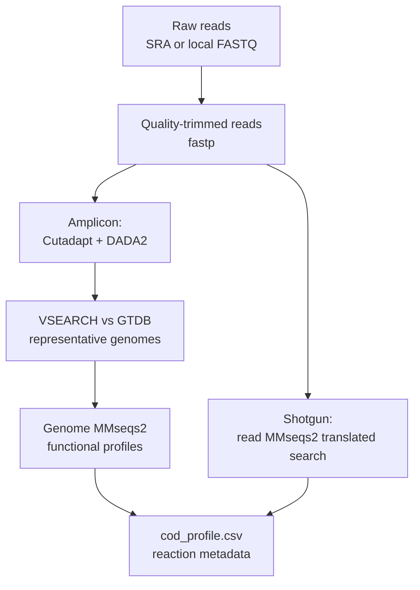

# Metagenomics Pipeline

ADToolbox converts metagenomics evidence into model-ready e-ADM microbial COD allocations from a sample table. The current pipeline is exposed through the `adtoolbox metagenomics process` CLI command and supports:

- SRA accession tables
- local FASTQ/FASTQ.GZ read tables
- raw amplicon reads processed with fastp, Cutadapt, and standalone DADA2
- shotgun reads aligned directly to the ADToolbox protein database with MMseqs2

Each sample row writes a dedicated output folder containing clean result CSVs, `pipeline.log`, and `provenance.json`. Generated command scripts, raw alignment files, DADA2 intermediates, and other working files are kept under that sample's `scratch/` folder.

Batch runs also write `workflow_state.json` and `workflow_events.jsonl` under `--output-dir`. These files keep a durable record of each sample and stage, so interrupted runs can be resumed and cached outputs can be skipped.



New to the pipeline? The [Quickstart](Quickstart.md#4-turn-sequencing-data-into-microbial-cod) has a shorter, worked example. This page is the complete reference.

## Amplicon Reads

Raw amplicon reads are handled in four stages:

1. Trim adapters, low-quality tails, and short reads with fastp. Explicit adapters can be supplied, otherwise fastp auto-detects common adapters. Paired runs retain passing orphan mates for an automatic R1-only fallback.
2. Detect a known universal primer pair and remove it with Cutadapt.
3. Infer exact ASVs, merge paired reads, and remove chimeras with standalone DADA2.

After paired fastp filtering, ADToolbox compares the surviving pair count with `min_reads_for_denoising`. When enough pairs remain, Cutadapt and DADA2 run paired-end. When the pair count is below the threshold but at least that many valid R1 reads remain, `allow_single_end_fallback = true` selects single-end R1 Cutadapt and DADA2 automatically. The decision and counts are written to `scratch/amplicon_preprocess/read-selection.json`; `read-layout.txt` carries the runtime choice between the dependent Slurm tasks. If neither layout has enough reads, trimming exits with non-retryable status 64 and the other samples continue.
4. Map representative sequences to GTDB, connect genomes to ADToolbox protein alignments, and aggregate the resulting e-ADM COD allocation.

This path does not install or invoke QIIME2. DADA2 is called directly through `Rscript`; VSEARCH remains a separate lightweight dependency for mapping the resulting representative sequences to GTDB.

### Universal primer catalog

With `primer_mode = "auto"`, ADToolbox checks the starts of both read directions against the packaged catalog at `adtoolbox/pkg_data/amplicon_primers.tsv`. Detection supports IUPAC ambiguity codes, sequencing errors, and short leading heterogeneity spacers. A pair is accepted only when both read directions pass `primer_min_fraction` (0.80 in the reference profile). The selected pair and the top candidate scores are saved in `scratch/amplicon_preprocess/detected_primers.json`.

The catalog is a tab-separated file with `name`, `forward_primer`, `reverse_primer`, and `target_region` columns. To use a larger or project-specific catalog, set `primer_catalog` in `[steps.build_amplicon_features.settings]`. A primer pair can also be supplied for one sample by adding `forward_primer` and `reverse_primer` columns to the manifest, or for the whole run with the matching CLI options. Explicit primers override automatic detection.

If no pair passes the threshold, the sample fails before Slurm submission with candidate scores in the error message. This is deliberate: continuing with an unknown primer layout can create an empty or misleading ASV table.

The main preprocessing artifacts are:

- `feature-table.tsv` — per-sample ASV counts
- `rep-seqs.fasta` — ASV sequences with stable sequence-derived IDs
- `dada2-stats.tsv` — input, filtered, denoised, merged, and non-chimeric read counts
- `detected_primers.json` and `<sample>_cutadapt.json` — primer audit and trimming report
- `read-selection.json` and `read-layout.txt` — fastp paired/single-end decision, thresholds, and retained read counts

For local reads, use a table with `sample`, `read_1`, and optionally `read_2`:

```tsv
sample	read_1	read_2
sample_01	./fastq/sample_01_R1.fastq.gz	./fastq/sample_01_R2.fastq.gz
sample_02	./fastq/sample_02_R1.fastq.gz	./fastq/sample_02_R2.fastq.gz
```

For SRA samples, use a table with `sample` and `accession`:

```tsv
sample	accession
sample_01	SRR28403133
sample_02	SRR28403134
```

```bash
adtoolbox metagenomics process \
  --input ./metagenomics/read_samples.tsv \
  --input-type reads \
  --assay amplicon \
  --output-dir ./metagenomics/process \
  --adapter-1 AGATCGGAAGAGCACACGTCTGAACTCCAGTCA \
  --adapter-2 AGATCGGAAGAGCGTCGTGTAGGGAAAGAGTGT \
  --amplicon-to-genome-db ./database/amplicon_to_genome \
  --genomes-dir ./metagenomics/genomes \
  --reaction-db ./database/Reaction_Metadata.csv \
  --execution-profile reference_data/metagenomics_pipeline.toml \
  --execute
```

For SRA tables, use the same command with `--input-type sra` and an SRA download directory:

```bash
adtoolbox metagenomics process \
  --input ./metagenomics/sra_samples.tsv \
  --input-type sra \
  --assay amplicon \
  --output-dir ./metagenomics/process \
  --sra-dir ./metagenomics/sra \
  --amplicon-to-genome-db ./database/amplicon_to_genome \
  --genomes-dir ./metagenomics/genomes \
  --reaction-db ./database/Reaction_Metadata.csv \
  --execution-profile reference_data/metagenomics_pipeline.toml \
  --execute
```

## Shotgun Reads

Shotgun mode turns read-level functional evidence directly into the e-ADM COD allocation:

1. Download SRA reads when needed.
2. Trim adapters, low-quality tails, and short reads with fastp.
3. Submit one `align_short_reads` MMseqs2 translated-search job for the sample. For paired-end data, both trimmed mates are added to the same query database.
4. Filter hits by `--e-value` and `--bit-score`, count each unique query/EC pair, map ECs through `Reaction_Metadata.csv`, and write the normalized microbial-group profile.

It skips primer detection, Cutadapt, DADA2, GTDB, genome downloads, and genome alignments. This route is functional rather than taxonomic: its clean outputs are `ec_counts.csv` and `cod_profile.csv`.

The local-read manifest has `sample`, `read_1`, and optional `read_2` columns. A `paired` column can explicitly select paired or single-end handling. When `paired` is true, `read_2` is required.

```bash
adtoolbox metagenomics process \
  --input ./metagenomics/shotgun_samples.tsv \
  --input-type reads \
  --assay shotgun \
  --output-dir ./metagenomics/process \
  --protein-db ./database/Protein_DB.fasta \
  --reaction-db ./database/Reaction_Metadata.csv \
  --sample-workers 4 \
  --execution-profile reference_data/metagenomics_pipeline.toml \
  --execute
```

For SRA, use the same two-column `sample`/`accession` table as the amplicon route, change `--input-type` to `sra`, and provide `--sra-dir`.

All MMseqs query, result, and temporary databases are written under `<output>/<sample>/scratch/shotgun_alignment/`; source FASTQ directories are never used as work directories. A prebuilt `protein_db_mmseqs` beside the protein FASTA is reused. If it is absent, each sample job builds a private target database from `Protein_DB.fasta`, so the CLI still works without a separate database-building command. On success, the large `mmseqs_work` directory is removed by default while the alignment TSV is retained. Set `steps.align_short_reads.settings.keep_work = true` to retain it; failed work directories are always left in place for debugging.

Successful read-input signatures are stored in `scratch/shotgun_downstream_inputs.json`. A rerun reuses the trimmed reads, alignment, and COD profile when the inputs are unchanged; changing a trimmed read invalidates the downstream cache.

## Execution Profiles

Use a TOML execution profile to choose local or Slurm execution per step. The reference profile is `reference_data/metagenomics_pipeline.toml`.

The reference profile uses `container = "None"`, so commands run from the active Conda environment on the compute node. Container image selection remains available through a top-level or step-specific `image` key when Docker or Apptainer is wanted.

Slurm steps use `sbatch --wait --parsable`. The application waits for each task to finish, validates its outputs, and only then starts the next task for that sample. It does not use Slurm dependency directives.

Sample pipelines run concurrently with a bounded worker pool. `--sample-workers 4` is the default: up to four samples can be active at once, while the tasks inside each sample remain strictly sequential. Set it to `1` for serial execution or lower it when scheduler or download limits require less concurrency.

Each named task is one Slurm job per sample. In particular, `align_genomes` contains all required genome-to-protein MMseqs alignments for that sample and runs them sequentially inside one job. Completed alignment files are reused on retries and reruns. Each MMseqs command receives a unique absolute temporary directory under `scratch/genome_alignments/mmseqs_tmp/<genome_accession>`.

Slurm retries are opt-in. Set `retries` under `[slurm]` for a global default, or under a specific `[steps.<name>]` table for one step. Every attempt is a separate `sbatch --wait` submission with its own Slurm job ID. A failed, timed-out, preempted, or manually cancelled attempt returns control to ADToolbox; after `retry_delay_seconds`, ADToolbox submits a fresh job. The generated sbatch script contains the task once and has no Bash retry loop.

To stop a task permanently, stop the controlling `adtoolbox metagenomics process` command before calling `scancel`. If the controller remains alive, a manually cancelled attempt is treated like another retryable Slurm failure and may be resubmitted.

Exit status 64 marks a deterministic no-feature result, such as DADA2 retaining no non-chimeric ASVs. Status 127 marks a missing executable or DADA2 R dependency. Those statuses are not resubmitted because another allocation cannot fix them. Other failures, including cancellation, retain the configured retry behavior.

When all retries are exhausted, ADToolbox marks that sample and stage as `failed`, records the error in `batch_summary.json` and the workflow log, skips the remaining tasks for that sample, and continues with the next sample in the manifest.

For each sample, `download_genomes` deduplicates missing assembly accessions and uses one NCBI Datasets dehydrated package plus `datasets rehydrate` instead of submitting one download per genome. Set `steps.download_genomes.settings.max_workers` between 1 and 30 to bound concurrent transfers; the default is 10. Genomes already present in `--genomes-dir` are not downloaded again. If either NCBI Datasets or `unzip` is unavailable, the same task automatically falls back to sequential HTTPS downloads from the NCBI assembly archive.

Unavailable, suppressed, or deprecated assembly accessions are skipped individually and recorded in `scratch/genome_download/failed_genomes.txt` and the sample provenance as `skipped_genome_fastas`. Valid genomes continue through alignment and COD calculation. A sample for which no requested genome is available finishes as `completed_no_available_genomes` instead of retrying indefinitely.

Important step names are:

- `download_sra`
- `download_genomes`
- `trim_reads`
- `build_amplicon_features`
- `align_to_gtdb`
- `align_genomes`
- `align_short_reads`

Without `--execute`, ADToolbox writes scripts and Slurm files but does not run or submit them.

Final COD files are only written when real upstream data exists. If a required alignment or amplicon intermediate is missing, the sample is marked with a waiting status in the workflow state instead of silently completing. Amplicon GTDB/COD caches are tied to a SHA-256 signature of the feature table and representative FASTA. Shotgun alignment/COD caches are tied to the resolved paths, sizes, and modification times of the trimmed reads.

When a DADA2 profile is selected, legacy VSEARCH `feature-table.tsv` and `rep-seqs.fasta` files are not considered a complete preprocessing cache unless the DADA2 statistics and primer audit are also present. Read downloads, genome FASTAs, and compatible genome-to-protein alignments can still be reused.

## Stages

Both the CLI and the Python API can run one stage at a time. In the usual Slurm setup, `--stage all` waits for each submitted step and runs the full sample pipeline through downstream amplicon-to-genome mapping and COD allocation.

| Stage | Does |
| --- | --- |
| `download` | Fetch reads from SRA. Skipped for local read tables. |
| `preprocess` | Both: quality-trim with fastp. Amplicon additionally removes primers with Cutadapt and infers ASVs with DADA2. |
| `allocate` (CLI) / `cod` (Python) | Amplicon: GTDB/genome work and COD. Shotgun: align trimmed reads with MMseqs2 and calculate EC/COD tables. |
| `all` | Run every applicable stage in order. |

!!! warning "The last stage has two names"
    The CLI option is `--stage allocate`, but [`batch_sample_to_cod`](api-core.md#adtoolbox.core.Metagenomics.batch_sample_to_cod) expects `stage="cod"`. The CLI translates between them; passing `"allocate"` directly to the Python API raises `ValueError`.

## Python Step API

Each external step can also be called directly from Python. The direct step methods use the same TOML execution profile and return the same artifact structure used by the CLI.

```python
from adtoolbox import configs, core

mg = core.Metagenomics(configs.Metagenomics(database_dir="./database"))

trim = mg.run_trim_reads_step(
    sample_name="sample_01",
    output_dir="./metagenomics/process",
    read_1="./metagenomics/sample_01/R1.fastq.gz",
    read_2="./metagenomics/sample_01/R2.fastq.gz",
    adapter_1="AGATCGGAAGAGCACACGTCTGAACTCCAGTCA",
    adapter_2="AGATCGGAAGAGCGTCGTGTAGGGAAAGAGTGT",
    execution_profile="reference_data/metagenomics_pipeline.toml",
    execute=False,
)

features = mg.run_build_amplicon_features_step(
    sample_name="sample_01",
    output_dir="./metagenomics/process",
    read_1=trim["artifacts"]["trimmed_reads"]["read_1"],
    read_2=trim["artifacts"]["trimmed_reads"]["read_2"],
    execution_profile="reference_data/metagenomics_pipeline.toml",
    execute=False,
)
```

Available direct step methods:

- [`run_trim_reads_step`](api-core.md#adtoolbox.core.Metagenomics.run_trim_reads_step)
- [`run_build_amplicon_features_step`](api-core.md#adtoolbox.core.Metagenomics.run_build_amplicon_features_step)
- [`run_sra_download_step`](api-core.md#adtoolbox.core.Metagenomics.run_sra_download_step)
- [`run_gtdb_alignment_step`](api-core.md#adtoolbox.core.Metagenomics.run_gtdb_alignment_step)
- [`run_genome_alignment_step`](api-core.md#adtoolbox.core.Metagenomics.run_genome_alignment_step)
- [`run_short_read_alignment_step`](api-core.md#adtoolbox.core.Metagenomics.run_short_read_alignment_step)

## Running the whole batch from Python

The CLI is a thin wrapper around [`batch_sample_to_cod`](api-core.md#adtoolbox.core.Metagenomics.batch_sample_to_cod), which takes the same options as keyword arguments:

```python
from adtoolbox import configs, core

mg = core.Metagenomics(
    configs.Metagenomics("./metagenomics/process", database_dir="./database")
)

result = mg.batch_sample_to_cod(
    manifest="./metagenomics/read_samples.tsv",
    assay="amplicon",
    input_type="reads",
    output_dir="./metagenomics/process",
    stage="all",
    amplicon_to_genome_db="./database/Amplicon2GenomeDBs",
    genomes_dir="./metagenomics/genomes",
    execution_profile="reference_data/metagenomics_pipeline.toml",
    execute=True,
)

print(result["samples"])   # per-sample artifact paths
print(result["summary"])   # path to batch_summary.json
```

For shotgun data, set `assay="shotgun"`; `amplicon_to_genome_db` and `genomes_dir` are then unnecessary.

For a single sample, [`sample_to_cod`](api-core.md#adtoolbox.core.Metagenomics.sample_to_cod) runs the same logic without the manifest.

## Direct gene-marker allocation

The direct allocator bypasses EC-to-reaction metadata. It scores curated, diagnostic
gene-family panels for each genome, then weights those genome scores by their abundance
in each sample. All 15 existing e-ADM COD groups have at least one curated panel.

This is the preferred allocation path. For both genome and shotgun MMseqs alignments,
ADToolbox recognizes a marker alias in any pipe-delimited target header, for example:

```text
>UniProt_P12345|mcrA
>dbCAN_reference_42|GH5
```

Pass that FASTA as `--protein-db`. Validate both halves of the database before a run:

```bash
adtoolbox metagenomics validate-marker-catalog --catalog gene_marker_catalog.json
adtoolbox metagenomics validate-marker-protein-db \
  --catalog gene_marker_catalog.json \
  --protein-db Marker_Protein_DB.fasta
```

To assemble the target database without hand-editing FASTA headers, prepare a CSV/TSV
manifest pointing to curated reference sequences for each family:

```text
marker_id,source_fasta
mcrA,references/mcrA.faa
GH5,references/GH5.faa.gz
```

Then build and validate it:

```bash
adtoolbox database build-marker-protein-db \
  --manifest marker_references.tsv \
  --output Marker_Protein_DB.fasta

adtoolbox metagenomics validate-marker-protein-db \
  --protein-db Marker_Protein_DB.fasta
```

Reference sequences are deliberately separate from the rule catalog: changing a scoring
rule should not silently change sequence homology, and adding reference diversity should
not change the biochemical interpretation. Use reviewed proteins or validated family
profiles and retain their source/version alongside the manifest.

### Choosing MMseqs or HMMER

`--marker-backend mmseqs` is the default. It accepts the marker-labeled protein FASTA
above and works for genome FASTAs and raw shotgun reads. ADToolbox ships a compact
prebuilt database at
`adtoolbox/pkg_data/marker_databases/v0.2.0/Marker_Protein_DB.fasta`, which is selected
automatically when `--protein-db` is omitted. A bundled `Marker_Protein_DB_mmseqs*`
database is reused across samples, so the default does not rebuild the target database
inside every sample job.

`--marker-backend hmmer` is available for the genome-based amplicon route and for
precomputed genome annotations. ADToolbox predicts proteins with Prodigal and searches
them with `hmmsearch`. It is not offered for unassembled shotgun FASTQ because profile
HMMs search proteins, not raw nucleotide reads.

The matching prebuilt `Marker_Profiles.hmm` and `Marker_Profile_Cutoffs.csv` are in the
same versioned directory and are also selected automatically. `profile_manifest.tsv`,
`SOURCES.json`, `SHA256SUMS`, and `rebuild.py` make the bundled assets auditable and
rebuildable. The HMM backend is preferred when sensitivity matters; MMseqs uses compact
HMM consensus sequences for faster screening.

Build a compact HMM collection from selected dbCAN, KOfam, Pfam, or custom profiles with
a manifest like:

```text
marker_id,source_hmm,profile_id,score_threshold,score_type
mcrA,kofam/profiles/K00399.hmm,K00399,775.53,full
GH5,dbCAN.hmm,GH5.hmm,,full
```

```bash
adtoolbox database build-marker-hmm-db \
  --manifest marker_hmms.tsv \
  --output Marker_Profiles.hmm \
  --cutoffs-output Marker_Profile_Cutoffs.csv

adtoolbox metagenomics process \
  ... \
  --marker-backend hmmer \
  --marker-hmm-db Marker_Profiles.hmm \
  --marker-hmm-cutoffs Marker_Profile_Cutoffs.csv
```

The HMM manifest is the provenance record: it pins the upstream collection, original
profile ID, canonical ADToolbox marker, and any family-specific trusted score. Without
an adaptive score, the default filters are independent E-value `1e-15` and profile
coverage `0.35`.

For Slurm, the optional step override is:

```toml
[steps.annotate_genomes]
backend = "slurm"
container = "None"
cpus = 8
memory = "24G"
time = "04:00:00"
retries = 3

[steps.annotate_genomes.settings]
threads = 8
prodigal_mode = "single"
```

When recognized marker targets occur, the normal `adtoolbox metagenomics process`
command writes `marker_counts.csv` and calculates COD directly from pathway panels.
The old EC/reaction parser is used only when an old protein database produces no
recognized marker targets.

The marker-hit input is a tall CSV or TSV with at least these columns:

```text
genome_id,marker_id
GCF_000001,mcrA
GCF_000001,fwdA
```

Optional `bits`, `evalue`, `identity`, and `coverage` columns can be filtered from the
CLI. Classify each unique genome once:

```bash
adtoolbox metagenomics validate-marker-catalog

adtoolbox metagenomics classify-markers \
  --hits genome_marker_hits.tsv \
  --min-bits 50 --max-evalue 1e-10 \
  --output genome_cod_scores.csv
```

Then combine those cached scores with a tall `sample,genome_id,abundance` table:

```bash
adtoolbox metagenomics aggregate-marker-cod \
  --scores genome_cod_scores.csv \
  --abundances sample_genome_abundance.tsv \
  --output sample_cod_profiles.csv
```

The companion `sample_cod_profiles_qc.csv` reports the fraction of genome abundance
that had at least one positive curated classification. This prevents normalization from
hiding how much of a community lacked sufficient pathway evidence.

Rules live in `adtoolbox/pkg_data/gene_marker_catalog.json`. A group can have multiple
alternative panels. Each panel declares marker weights, markers that must all occur,
alternative-marker clauses, a minimum marker count, and a minimum weighted completeness.
Aliases are resolved case-insensitively. Copy the catalog, edit it, validate it, and pass
it with `--catalog`; no Python changes are needed.

Carbohydrate hydrolysis (`X_ch`) is represented by separate cellulose, xylan, starch,
and pectin panels combining CAZyme families with binding, transport, or intracellular
utilization evidence. Sugar fermentation (`X_su`) separately requires a transporter,
central pathway coverage, and a fermentative outlet. Generic glycolysis or a lone
glycosidase therefore cannot classify a genome by itself.

The other modules cover protein and lipid hydrolysis, Stickland amino-acid fermentation,
LCFA beta oxidation, ethanol/lactate uptake, donor-specific reverse beta oxidation,
syntrophic propionate/butyrate oxidation, and acetoclastic/hydrogenotrophic
methanogenesis. Reverse beta-oxidation is reversible, so `X_VFA_deg` additionally needs
hydrogen/formate-transfer or energy-conservation evidence. Even then, DNA establishes
potential rather than in situ direction; feed chemistry or expression data is needed to
resolve the active direction with confidence.

## See also

- [CLI reference](CLI.md#processing-pipeline) — every `process` option and output file.
- [`core.Metagenomics` API](api-core.md#adtoolbox.core.Metagenomics) — generated reference for all methods.
- [Parameter tuning](Optimization.md) — what to do with the COD profile once you have it.
