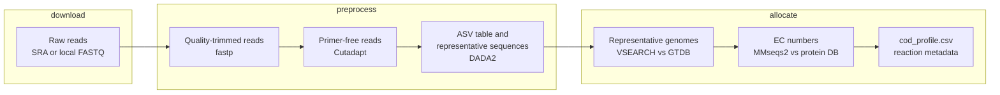

# Metagenomics Pipeline

ADToolbox converts metagenomics evidence into model-ready e-ADM microbial COD allocations from a sample table. The current pipeline is exposed through the `adtoolbox metagenomics process` CLI command and supports:

- SRA accession tables
- local FASTQ/FASTQ.GZ read tables
- raw amplicon reads processed with fastp, Cutadapt, and standalone DADA2

Each sample row writes a dedicated output folder containing clean result CSVs, `pipeline.log`, and `provenance.json`. Generated command scripts, raw alignment files, DADA2 intermediates, and other working files are kept under that sample's `scratch/` folder.

Batch runs also write `workflow_state.json` and `workflow_events.jsonl` under `--output-dir`. These files keep a durable record of each sample and stage, so interrupted runs can be resumed and cached outputs can be skipped.



New to the pipeline? The [Quickstart](Quickstart.md#4-turn-amplicon-data-into-microbial-cod) has a shorter, worked example. This page is the complete reference.

## Amplicon Reads

Raw amplicon reads are handled in four stages:

1. Trim adapters, low-quality tails, and short reads with fastp. Explicit adapters can be supplied, otherwise fastp auto-detects common adapters.
2. Detect a known universal primer pair and remove it with Cutadapt.
3. Infer exact ASVs, merge paired reads, and remove chimeras with standalone DADA2.
4. Map representative sequences to GTDB, connect genomes to ADToolbox protein alignments, and aggregate the resulting e-ADM COD allocation.

This path does not install or invoke QIIME2. DADA2 is called directly through `Rscript`; VSEARCH remains a separate lightweight dependency for mapping the resulting representative sequences to GTDB.

### Universal primer catalog

With `primer_mode = "auto"`, ADToolbox checks the starts of both read directions against the packaged catalog at `adtoolbox/pkg_data/amplicon_primers.tsv`. Detection supports IUPAC ambiguity codes, sequencing errors, and short leading heterogeneity spacers. A pair is accepted only when both read directions pass `primer_min_fraction` (0.80 in the reference profile). The selected pair and the top candidate scores are saved in `scratch/amplicon_preprocess/detected_primers.json`.

The catalog is a tab-separated file with `name`, `forward_primer`, `reverse_primer`, and `target_region` columns. To use a larger or project-specific catalog, set `primer_catalog` in `[steps.build_amplicon_features.settings]`. A primer pair can also be supplied for one sample by adding `forward_primer` and `reverse_primer` columns to the manifest, or for the whole run with the matching CLI options. Explicit primers override automatic detection.

If no pair passes the threshold, the sample fails before Slurm submission with candidate scores in the error message. This is deliberate: continuing with an unknown primer layout can create an empty or misleading ASV table.

The main preprocessing artifacts are:

- `feature-table.tsv` — per-sample ASV counts
- `rep-seqs.fasta` — ASV sequences with stable sequence-derived IDs
- `dada2-stats.tsv` — input, filtered, denoised, merged, and non-chimeric read counts
- `detected_primers.json` and `<sample>_cutadapt.json` — primer audit and trimming report

For local reads, use a table with `sample`, `read_1`, and optionally `read_2`:

```tsv
sample	read_1	read_2
sample_01	./fastq/sample_01_R1.fastq.gz	./fastq/sample_01_R2.fastq.gz
sample_02	./fastq/sample_02_R1.fastq.gz	./fastq/sample_02_R2.fastq.gz
```

For SRA samples, use a table with `sample` and `accession`:

```tsv
sample	accession
sample_01	SRR28403133
sample_02	SRR28403134
```

```bash
adtoolbox metagenomics process \
  --input ./metagenomics/read_samples.tsv \
  --input-type reads \
  --output-dir ./metagenomics/process \
  --adapter-1 AGATCGGAAGAGCACACGTCTGAACTCCAGTCA \
  --adapter-2 AGATCGGAAGAGCGTCGTGTAGGGAAAGAGTGT \
  --amplicon-to-genome-db ./database/amplicon_to_genome \
  --genomes-dir ./metagenomics/genomes \
  --reaction-db ./database/Reaction_Metadata.csv \
  --execution-profile reference_data/metagenomics_pipeline.toml \
  --execute
```

For SRA tables, use the same command with `--input-type sra` and an SRA download directory:

```bash
adtoolbox metagenomics process \
  --input ./metagenomics/sra_samples.tsv \
  --input-type sra \
  --output-dir ./metagenomics/process \
  --sra-dir ./metagenomics/sra \
  --amplicon-to-genome-db ./database/amplicon_to_genome \
  --genomes-dir ./metagenomics/genomes \
  --reaction-db ./database/Reaction_Metadata.csv \
  --execution-profile reference_data/metagenomics_pipeline.toml \
  --execute
```

## Execution Profiles

Use a TOML execution profile to choose local or Slurm execution per step. The reference profile is `reference_data/metagenomics_pipeline.toml`.

The reference profile uses `container = "None"`, so commands run from the active Conda environment on the compute node. Container image selection remains available through a top-level or step-specific `image` key when Docker or Apptainer is wanted.

Slurm steps use `sbatch --wait --parsable`. The application waits for each task to finish, validates its outputs, and only then starts the next task for that sample. It does not use Slurm dependency directives.

Sample pipelines run concurrently with a bounded worker pool. `--sample-workers 4` is the default: up to four samples can be active at once, while the tasks inside each sample remain strictly sequential. Set it to `1` for serial execution or lower it when scheduler or download limits require less concurrency.

Each named task is one Slurm job per sample. In particular, `align_genomes` contains all required genome-to-protein MMseqs alignments for that sample and runs them sequentially inside one job. Completed alignment files are reused on retries and reruns. Each MMseqs command receives a unique absolute temporary directory under `scratch/genome_alignments/mmseqs_tmp/<genome_accession>`.

Slurm retries are opt-in. Set `retries` under `[slurm]` for a global default, or under a specific `[steps.<name>]` table for one step. Every attempt is a separate `sbatch --wait` submission with its own Slurm job ID. A failed, timed-out, preempted, or manually cancelled attempt returns control to ADToolbox; after `retry_delay_seconds`, ADToolbox submits a fresh job. The generated sbatch script contains the task once and has no Bash retry loop.

To stop a task permanently, stop the controlling `adtoolbox metagenomics process` command before calling `scancel`. If the controller remains alive, a manually cancelled attempt is treated like another retryable Slurm failure and may be resubmitted.

Exit status 64 marks a deterministic no-feature result, such as DADA2 retaining no non-chimeric ASVs. Status 127 marks a missing executable or DADA2 R dependency. Those statuses are not resubmitted because another allocation cannot fix them. Other failures, including cancellation, retain the configured retry behavior.

When all retries are exhausted, ADToolbox marks that sample and stage as `failed`, records the error in `batch_summary.json` and the workflow log, skips the remaining tasks for that sample, and continues with the next sample in the manifest.

For each sample, `download_genomes` deduplicates missing assembly accessions and uses one NCBI Datasets dehydrated package plus `datasets rehydrate` instead of submitting one download per genome. Set `steps.download_genomes.settings.max_workers` between 1 and 30 to bound concurrent transfers; the default is 10. Genomes already present in `--genomes-dir` are not downloaded again. If either NCBI Datasets or `unzip` is unavailable, the same task automatically falls back to sequential HTTPS downloads from the NCBI assembly archive.

Unavailable, suppressed, or deprecated assembly accessions are skipped individually and recorded in `scratch/genome_download/failed_genomes.txt` and the sample provenance as `skipped_genome_fastas`. Valid genomes continue through alignment and COD calculation. A sample for which no requested genome is available finishes as `completed_no_available_genomes` instead of retrying indefinitely.

Important step names are:

- `download_sra`
- `download_genomes`
- `trim_reads`
- `build_amplicon_features`
- `align_to_gtdb`
- `align_genomes`
- `align_short_reads`

Without `--execute`, ADToolbox writes scripts and Slurm files but does not run or submit them.

Final COD files are only written when real upstream data exists. If a GTDB match, genome FASTA, or genome alignment is missing, the sample is marked with a waiting status in the workflow state instead of producing a header-only `cod_profile.csv`. Downstream GTDB and COD caches are tied to a SHA-256 signature of the feature table and representative FASTA, so changing from VSEARCH features to DADA2 features forces the affected downstream work to run again.

When a DADA2 profile is selected, legacy VSEARCH `feature-table.tsv` and `rep-seqs.fasta` files are not considered a complete preprocessing cache unless the DADA2 statistics and primer audit are also present. Read downloads, genome FASTAs, and compatible genome-to-protein alignments can still be reused.

## Stages

Both the CLI and the Python API can run one stage at a time. In the usual Slurm setup, `--stage all` waits for each submitted step and runs the full sample pipeline through downstream amplicon-to-genome mapping and COD allocation.

| Stage | Does |
| --- | --- |
| `download` | Fetch reads from SRA. Skipped for local read tables. |
| `preprocess` | Quality-trim with fastp, remove primers with Cutadapt, and infer ASVs with DADA2. |
| `allocate` (CLI) / `cod` (Python) | Map to GTDB, align to the protein database, and write the COD profile. |
| `all` | Run every applicable stage in order. |

!!! warning "The last stage has two names"
    The CLI option is `--stage allocate`, but [`batch_sample_to_cod`](api-core.md#adtoolbox.core.Metagenomics.batch_sample_to_cod) expects `stage="cod"`. The CLI translates between them; passing `"allocate"` directly to the Python API raises `ValueError`.

## Python Step API

Each external step can also be called directly from Python. The direct step methods use the same TOML execution profile and return the same artifact structure used by the CLI.

```python
from adtoolbox import configs, core

mg = core.Metagenomics(configs.Metagenomics(database_dir="./database"))

trim = mg.run_trim_reads_step(
    sample_name="sample_01",
    output_dir="./metagenomics/process",
    read_1="./metagenomics/sample_01/R1.fastq.gz",
    read_2="./metagenomics/sample_01/R2.fastq.gz",
    adapter_1="AGATCGGAAGAGCACACGTCTGAACTCCAGTCA",
    adapter_2="AGATCGGAAGAGCGTCGTGTAGGGAAAGAGTGT",
    execution_profile="reference_data/metagenomics_pipeline.toml",
    execute=False,
)

features = mg.run_build_amplicon_features_step(
    sample_name="sample_01",
    output_dir="./metagenomics/process",
    read_1=trim["artifacts"]["trimmed_reads"]["read_1"],
    read_2=trim["artifacts"]["trimmed_reads"]["read_2"],
    execution_profile="reference_data/metagenomics_pipeline.toml",
    execute=False,
)
```

Available direct step methods:

- [`run_trim_reads_step`](api-core.md#adtoolbox.core.Metagenomics.run_trim_reads_step)
- [`run_build_amplicon_features_step`](api-core.md#adtoolbox.core.Metagenomics.run_build_amplicon_features_step)
- [`run_sra_download_step`](api-core.md#adtoolbox.core.Metagenomics.run_sra_download_step)
- [`run_gtdb_alignment_step`](api-core.md#adtoolbox.core.Metagenomics.run_gtdb_alignment_step)
- [`run_genome_alignment_step`](api-core.md#adtoolbox.core.Metagenomics.run_genome_alignment_step)
- [`run_short_read_alignment_step`](api-core.md#adtoolbox.core.Metagenomics.run_short_read_alignment_step)

## Running the whole batch from Python

The CLI is a thin wrapper around [`batch_sample_to_cod`](api-core.md#adtoolbox.core.Metagenomics.batch_sample_to_cod), which takes the same options as keyword arguments:

```python
from adtoolbox import configs, core

mg = core.Metagenomics(
    configs.Metagenomics("./metagenomics/process", database_dir="./database")
)

result = mg.batch_sample_to_cod(
    manifest="./metagenomics/read_samples.tsv",
    input_type="reads",
    output_dir="./metagenomics/process",
    stage="all",
    amplicon_to_genome_db="./database/Amplicon2GenomeDBs",
    genomes_dir="./metagenomics/genomes",
    execution_profile="reference_data/metagenomics_pipeline.toml",
    execute=True,
)

print(result["samples"])   # per-sample artifact paths
print(result["summary"])   # path to batch_summary.json
```

For a single sample, [`sample_to_cod`](api-core.md#adtoolbox.core.Metagenomics.sample_to_cod) runs the same logic without the manifest.

## See also

- [CLI reference](CLI.md#processing-pipeline) — every `process` option and output file.
- [`core.Metagenomics` API](api-core.md#adtoolbox.core.Metagenomics) — generated reference for all methods.
- [Parameter tuning](Optimization.md) — what to do with the COD profile once you have it.
