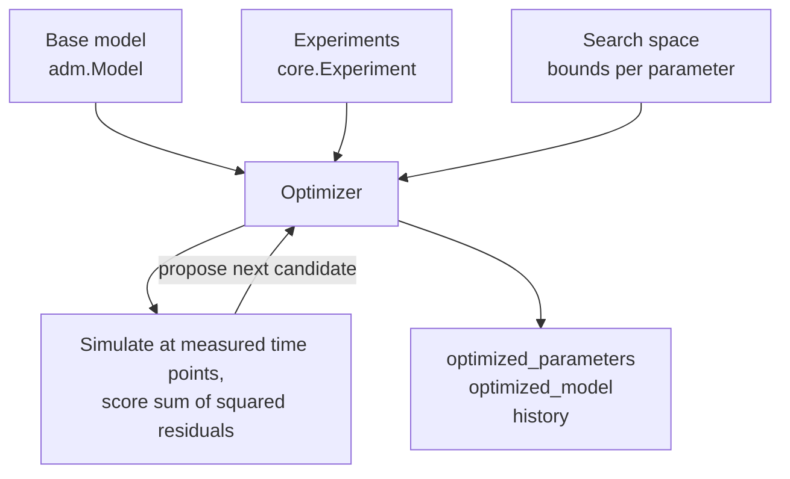

# Parameter Tuning

Published ADM parameter sets are a starting point, not an answer. The
[`adtoolbox.optimize`](api-optimize.md) module fits selected model parameters to your own
experimental time-series data, using one of four interchangeable optimizer backends behind
a single interface.



## The three inputs

Every optimizer takes the same three things.

**A base model.** Any [`adm.Model`](api-adm.md) instance. The optimizer never mutates it;
it deep-copies the model for each evaluation.

**Training data.** One or more [`core.Experiment`](api-core.md) objects. Each experiment
supplies observed concentrations, the time points they were measured at, the feed, and
optionally experiment-specific initial concentrations and base parameters.

**A search space.** A mapping from parameter name to bounds:

```python
search_space = {
    "k_m_su": (5.0, 60.0),                       # (lower, upper)
    "K_S_su": (0.1, 1.0, 0.5),                   # (lower, upper, default)
    "k_m_ac": {"lower": 2.0, "upper": 20.0},     # mapping form
    "k_dec_X_su": optimize.ParameterSpec("k_dec_X_su", 0.01, 0.1),
}
```

All four forms are accepted and normalized into
[`ParameterSpec`](api-optimize.md#adtoolbox.optimize.ParameterSpec) objects. The upper
bound must exceed the lower bound, and any default must fall inside them; violations raise
`ValueError` at construction time rather than partway through a long run.

### Where parameter names are looked up

By default (`parameter_target="auto"`) each name is resolved against the model in this
order:

1. `model_parameters`
2. `base_parameters`
3. `initial_conditions`
4. `inlet_conditions` (or a species name)

The first match wins, so you can mix kinetic constants and initial conditions in one
search space. If a name matches nothing, construction fails immediately with a message
naming the offending parameters.

Pin the lookup to one dictionary when a name is ambiguous:

```python
optimizer = optimize.ScipyOptimizer(
    base_model=model,
    train_data=experiments,
    search_space={"X_su": (0.05, 2.0)},
    parameter_target="initial_conditions",
)
```

## Choosing an optimizer

| Optimizer | Backend | Install | Best for |
| --- | --- | --- | --- |
| [`ScipyOptimizer`](api-optimize.md#adtoolbox.optimize.ScipyOptimizer) | SciPy differential evolution | included | The default. No extra dependencies, parallelizable. |
| [`BlackBoxOptimizer`](api-optimize.md#adtoolbox.optimize.BlackBoxOptimizer) | OpenBox (Bayesian) | `adtoolbox[blackbox]` | Few, expensive evaluations; sample-efficient search. |
| [`GeneticOptimizer`](api-optimize.md#adtoolbox.optimize.GeneticOptimizer) | PyGAD | `adtoolbox[genetic]` | Rugged landscapes and larger search spaces. |
| [`SurrogateOptimizer`](api-optimize.md#adtoolbox.optimize.SurrogateOptimizer) | PyTorch neural surrogate | `adtoolbox[surrogate]` | Very slow ODE solves, where a learned proxy pays off. |

Install all of them at once with `pip install "adtoolbox[optimize]"`. The optional backends
are imported lazily, so a missing package raises a clear `ImportError` naming the extra to
install, only when you actually instantiate that optimizer.

=== "SciPy (default)"

    ```python
    from adtoolbox import optimize

    optimizer = optimize.ScipyOptimizer(
        base_model=model,
        train_data=experiments,
        search_space=search_space,
        random_state=42,
    )

    result = optimizer.optimize(maxiter=100, popsize=15, polish=True, workers=1)
    ```

    Set `workers=-1` to use all cores. Note that every worker solves the full ODE system,
    so memory scales with the worker count.

=== "OpenBox"

    ```python
    optimizer = optimize.BlackBoxOptimizer(
        base_model=model,
        train_data=experiments,
        search_space=search_space,
    )

    result = optimizer.optimize(max_runs=100)
    ```

    Extra keyword arguments are forwarded to the OpenBox optimizer. Pass `parallel=True`
    to use `openbox.ParallelOptimizer`.

=== "Genetic"

    ```python
    optimizer = optimize.GeneticOptimizer(
        base_model=model,
        train_data=experiments,
        search_space=search_space,
    )

    ga = optimizer.optimize(num_generations=50, sol_per_pop=20)
    ```

    PyGAD maximizes fitness, so ADToolbox exposes `1 / (cost + eps)` internally. The
    recorded history still stores the raw cost, so it is comparable across optimizers.

=== "Surrogate"

    ```python
    optimizer = optimize.SurrogateOptimizer(
        base_model=model,
        train_data=experiments,
        search_space=search_space,
        hidden_size=30,
        hidden_layers=4,
        train_epochs=500,
    )

    history = optimizer.optimize(
        n_steps=100,
        initial_points=8,
        grad_steps=20,
        history_path="./tuning/surrogate_history.json",
        save_every=10,
    )
    ```

    A small feed-forward network is trained on the evaluation history, then differentiated
    with respect to its inputs to propose the next parameter vector. When two consecutive
    costs are identical the candidate is jittered to escape a flat region.

## The objective

All optimizers minimize the same quantity. For each experiment the model is prepared with
the candidate parameters, solved at exactly the experiment's time points, and compared to
the observed values:

```text
cost = sum over experiments, time points, and variables of (predicted - observed)^2
```

`sum_squared_error` is currently the only supported `fitness_mode`; passing anything else
raises `ValueError`. You can call
[`evaluate`](api-optimize.md#adtoolbox.optimize.Optimizer.evaluate) yourself to score a
parameter set without running a search:

```python
cost = optimizer.evaluate({"k_m_su": 30.0, "K_S_su": 0.5, "k_m_ac": 8.0})
```

!!! note "Experiment-specific setup is applied automatically"
    Before each solve the optimizer copies the base model and, for the experiment at hand,
    swaps in its `feed`, applies its `base_parameters` and `initial_concentrations`,
    overrides the initial value of every measured variable with its observed value at
    `t = 0`, and pins any state listed in `constants` as a control state. This is why
    experiments run at different pH values or feed compositions can be fit jointly in one
    `train_data` list.

## Reading the results

After `optimize()` returns, the optimizer carries the outcome:

| Attribute | Contents |
| --- | --- |
| `optimized_parameters` | `dict` of the best parameter values found. |
| `optimized_model` | A ready-to-solve `adm.Model` with those parameters applied. |
| `best_cost` | The lowest objective value seen. |
| `best_record` | The full `OptimizationRecord` for that point. |
| `history` | Every evaluation, in order, as `OptimizationRecord` objects. |

```python
print(f"best cost: {optimizer.best_cost:.4f}")
for name, value in optimizer.optimized_parameters.items():
    print(f"  {name} = {value:.4g}")

solution = optimizer.optimized_model.solve_model(np.linspace(0, 30, 300))
```

Each `OptimizationRecord` holds `step`, `parameters`, `cost`, and a `metadata` dict noting
which backend produced it, which makes the history straightforward to plot:

```python
import polars as pl

trace = pl.DataFrame([
    {"step": r.step, "cost": r.cost, **r.parameters}
    for r in optimizer.history
])
```

## Saving and resuming

Optimizer state serializes to JSON:

```python
optimizer.save("./tuning/run_01.json")
```

To resume, build an optimizer with the **same search space** and load the file. Loading
replays the saved history, which restores `best_cost`, `optimized_parameters`, and
`optimized_model`:

```python
resumed = optimize.ScipyOptimizer(
    base_model=model,
    train_data=experiments,
    search_space=search_space,
)
resumed.load("./tuning/run_01.json")
```

A mismatch between the saved parameter names and the current search space raises
`ValueError` rather than silently loading incompatible history.

## Validating the fit

Fitting reports a cost; validation tells you whether the fit is any good.
[`validate_model`](api-optimize.md#adtoolbox.optimize.validate_model) simulates the model
across the union of all experiment time points and returns tidy frames plus an optional
Plotly figure overlaying prediction and observation:

```python
frames, figure = optimize.validate_model(
    optimizer.optimized_model,
    experiments,
    plot=True,
    ode_solver="Radau",
)

frames["model"]   # predicted trajectories
frames["data"]    # observed values
```

[`calculate_fit_stats`](api-optimize.md#adtoolbox.optimize.calculate_fit_stats) reduces
that comparison to two numbers:

```python
stats = optimize.calculate_fit_stats(optimizer.optimized_model, experiments)
print(stats.r_squared, stats.rmse)
```

!!! warning "Always validate on held-out experiments"
    `r_squared` computed on the same experiments used for `train_data` measures fit, not
    predictive power. Hold back at least one experiment, or one operating condition, and
    report the statistics on that.

## A complete run

```python
import numpy as np
from adtoolbox import adm, configs, core, optimize, utils

# 1. Base model
payload = utils.load_model_json("reference_data/models.json", "e_adm")
model = adm.Model(
    model_parameters=payload["model_parameters"],
    base_parameters=payload["base_parameters"],
    initial_conditions=payload["initial_conditions"],
    inlet_conditions=payload["inlet_conditions"],
    reactions=payload["reactions"],
    species=payload["species"],
    feed=adm.DEFAULT_FEED,
    ode_system=adm.e_adm_ode_sys,
    build_stoichiometric_matrix=adm.build_e_adm_stoichiometric_matrix,
    control_state={"S_H_ion": 10 ** -6.5},
    name="e-ADM",
)

# 2. Experiments from the local database
db = core.Database(config=configs.Database(database_dir="./database"))
experiments = db.get_experiment_from_experiments_db("model_name", "e_adm")

train, test = experiments[:-1], experiments[-1:]

# 3. Fit
optimizer = optimize.ScipyOptimizer(
    base_model=model,
    train_data=train,
    search_space={
        "k_m_su": (5.0, 60.0),
        "K_S_su": (0.1, 1.0),
        "k_m_ac": (2.0, 20.0),
        "K_S_ac": (0.05, 0.5),
    },
    random_state=0,
)
optimizer.optimize(maxiter=50, popsize=15)
optimizer.save("./tuning/e_adm_fit.json")

# 4. Validate on the held-out experiment
stats = optimize.calculate_fit_stats(optimizer.optimized_model, test)
print(f"held-out R^2={stats.r_squared:.3f} RMSE={stats.rmse:.3f}")
```

## Practical notes

- **Keep the search space small.** Each evaluation solves the full stiff ODE system for
  every experiment. Ten parameters with a population-based optimizer is thousands of
  solves. Start with the parameters your data can actually constrain.
- **Bounds matter more than the algorithm.** Wide bounds let the solver wander into
  regions where the ODE integrates slowly or fails; tight, physically motivated bounds are
  the single biggest speedup available.
- **Watch the ODE method.** `ode_method` defaults to `"BDF"`, which suits the stiff ADM
  system. `"Radau"` is a reasonable alternative if you see integration failures.
- **Set `random_state`** for reproducible runs. It seeds both the optimizer and the
  internal RNG used for random restarts.

## Next steps

- [Parameter tuning walkthrough](parameter_tuning.html) — the same workflow as an
  executed notebook.
- [`optimize` API reference](api-optimize.md) — every class, method, and argument.
- [ADM models](ADM_Models.md) — what each tunable parameter means physically.
