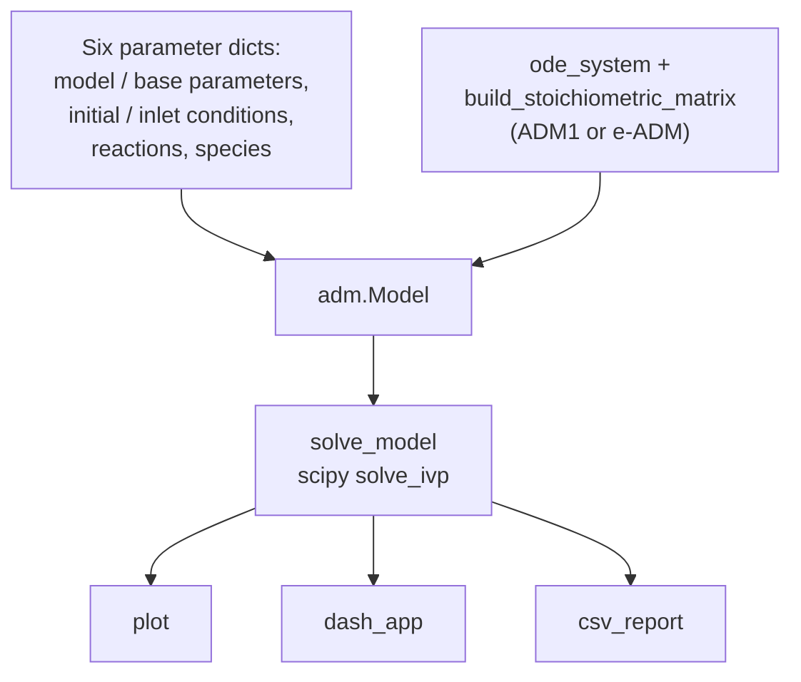

# `adm`

Model construction, ODE integration, and visualization for ADM1 and e-ADM.

```python
from adtoolbox import adm
```



A model is assembled from six parameter dictionaries plus two callables — one that builds
the stoichiometric matrix and one that evaluates the ODE right-hand side. Swapping those
two callables is what turns the same `Model` class into ADM1 or e-ADM.

```python
model = adm.Model(
    model_parameters=payload["model_parameters"],
    base_parameters=payload["base_parameters"],
    initial_conditions=payload["initial_conditions"],
    inlet_conditions=payload["inlet_conditions"],
    reactions=payload["reactions"],
    species=payload["species"],
    feed=adm.DEFAULT_FEED,
    ode_system=adm.e_adm_ode_sys,
    build_stoichiometric_matrix=adm.build_e_adm_stoichiometric_matrix,
    control_state={"S_H_ion": 10 ** -6.5},
)
```

See [ADM Models](ADM_Models.md) for the meaning of every parameter and the full
stoichiometry.

---

## Model

::: adtoolbox.adm.Model

---

## ADM1

### build_adm1_stoichiometric_matrix

::: adtoolbox.adm.build_adm1_stoichiometric_matrix

### adm1_ode_sys

::: adtoolbox.adm.adm1_ode_sys

---

## e-ADM

### build_e_adm_stoichiometric_matrix

::: adtoolbox.adm.build_e_adm_stoichiometric_matrix

### e_adm_ode_sys

::: adtoolbox.adm.e_adm_ode_sys
