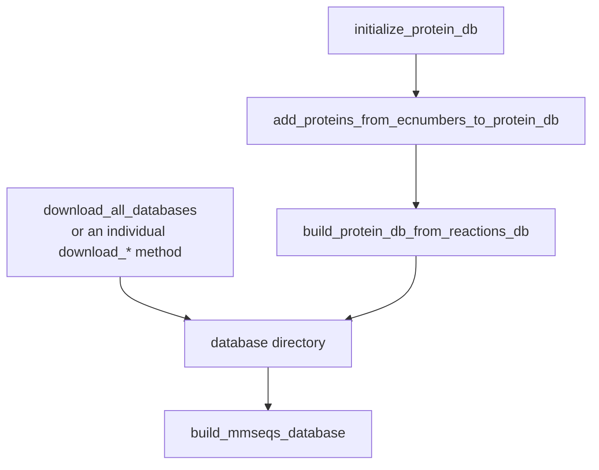
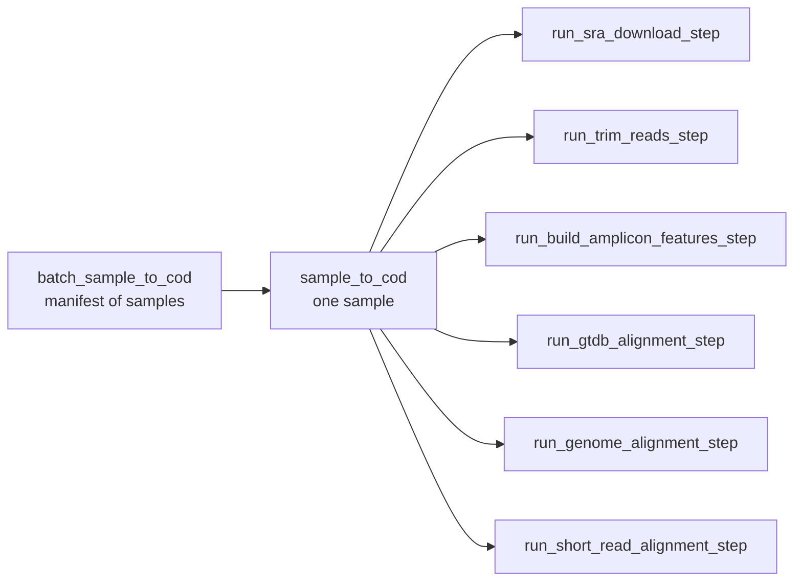

# `core`

The data model and the metagenomics pipeline. `core` holds the record types that move
between modules (feeds, experiments, reactions, metabolites), the database interface, and
the `Metagenomics` class that implements every pipeline step.

```python
from adtoolbox import configs, core

db = core.Database(config=configs.Database(database_dir="./database"))
mg = core.Metagenomics(configs.Metagenomics("./run", database_dir="./database"))
```

---

## Record types

Lightweight dataclasses that are serializable to and from the on-disk databases.

### Feed

::: adtoolbox.core.Feed

### Experiment

::: adtoolbox.core.Experiment

### MetagenomicsStudy

::: adtoolbox.core.MetagenomicsStudy

### Reaction

::: adtoolbox.core.Reaction

### Metabolite

::: adtoolbox.core.Metabolite

---

## Databases

### SeedDB

Interface to the ModelSEED reaction and compound databases, including EC-number lookups.

::: adtoolbox.core.SeedDB

### Database

Create, download, query, and extend every local ADToolbox database. There are two ways to
get a working database directory: download the prebuilt files, or build the protein
database yourself from reaction metadata.



The `download_*` methods each fetch one database; `download_all_databases` calls every one
of them in turn.

::: adtoolbox.core.Database

---

## Metagenomics

Everything from SRA download through amplicon denoising, GTDB mapping, protein alignment,
and COD allocation.

`batch_sample_to_cod` is the entry point the CLI uses; it drives `sample_to_cod` per
sample, which in turn calls the individual `run_*_step` methods. Any of those three levels
can be used directly.



See the [pipeline guide](Metagenomics_Pipeline.md) for the artifact chain these produce
and for execution profiles.

::: adtoolbox.core.Metagenomics

---

## Annotation

::: adtoolbox.core.Annotation

---

## Pipeline execution

Task bookkeeping and Slurm submission used by the batch pipeline.

### PipelineTask

::: adtoolbox.core.PipelineTask

### PipelineTaskManager

::: adtoolbox.core.PipelineTaskManager
