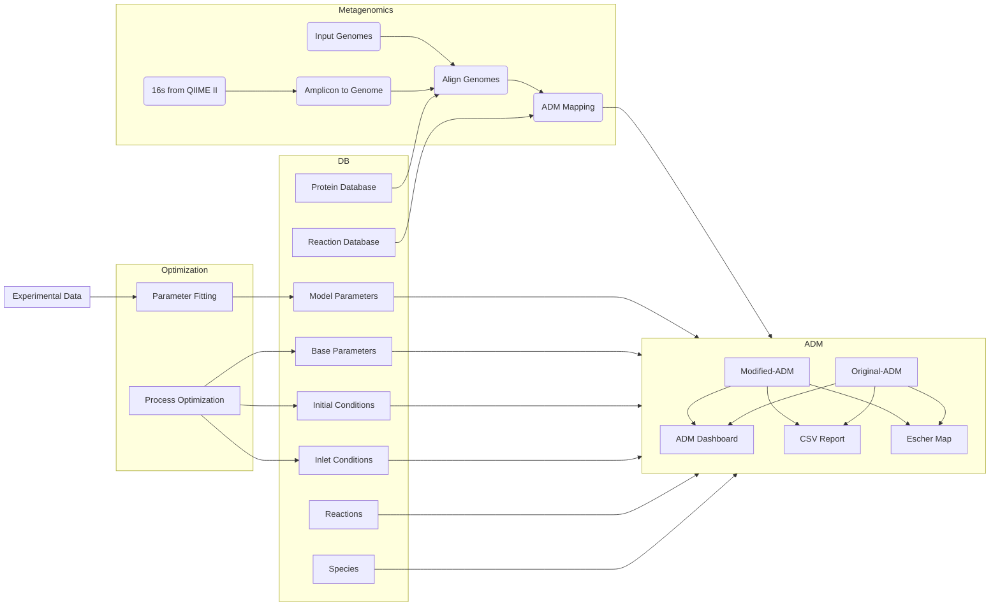

# Welcome to ADToolbox

Parsa Ghadermazi 
parsa96@colostate.edu

AD Toolbox is developed in Chan Lab at Colorado State University. The main goal of this toolbox is to provide the tools that are useful for modeling and optimization of anaerobic digestion process. The following diagram shows the ADToolbox workflow:

