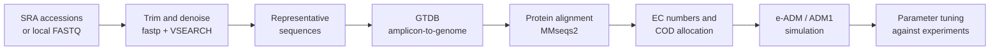

---
hide:
  - navigation
---

<div class="ad-hero" markdown>

# ADToolbox

**From raw sequencing reads to a calibrated anaerobic digestion model.**
ADToolbox connects metagenomics evidence, curated reaction and feed databases, and
dynamic ADM1 / e-ADM simulations into one reproducible Python and command-line workflow.

[Get started :material-arrow-right:](Quickstart.md){ .md-button .md-button--primary }
[Install](Installation.md){ .md-button }
[View on GitHub](https://github.com/chan-csu/ADToolbox){ .md-button }

</div>

## What ADToolbox does

Anaerobic digestion models such as ADM1 lump the microbial community into a handful of
guilds whose initial biomass you are expected to guess. ADToolbox replaces that guess with
measurement. It profiles a community two ways — 16S **amplicon** reads mapped through GTDB
and a curated enzyme-to-reaction database, or **shotgun** reads searched directly against
that database for functional evidence — and turns either into the microbial COD allocation
that an extended ADM (e-ADM) model actually needs. From there you can simulate, visualize,
and fit the
model against experimental data.


```mermaid
flowchart LR
    A[SRA accessions<br/>or local FASTQ] --> B[Trim and denoise<br/>fastp + VSEARCH]
    B --> C[Representative<br/>sequences]
    C --> D[GTDB<br/>amplicon-to-genome]
    D --> E[Protein alignment<br/>MMseqs2]
    E --> F[EC numbers and<br/>COD allocation]
    F --> G[e-ADM / ADM1<br/>simulation]
    G --> H[Parameter tuning<br/>against experiments]
```

## Explore the docs

<div class="grid cards" markdown>

-   :material-rocket-launch: **Quickstart**

    ---

    Install the package, download the reference databases, and run your first
    ADM simulation in a few minutes.

    [:octicons-arrow-right-24: Quickstart](Quickstart.md)

-   :material-dna: **Metagenomics pipeline**

    ---

    Turn a table of SRA accessions or FASTQ files into model-ready microbial COD
    allocations, locally or on Slurm.

    [:octicons-arrow-right-24: Pipeline guide](Metagenomics_Pipeline.md)

-   :material-chart-bell-curve: **ADM models**

    ---

    The full input contract, stoichiometry, rate laws, and inhibition terms for
    ADM1 and e-ADM.

    [:octicons-arrow-right-24: Model reference](ADM_Models.md)

-   :material-tune-variant: **Parameter tuning**

    ---

    Fit kinetic parameters to experimental data with SciPy, OpenBox, genetic, or
    neural-surrogate optimizers.

    [:octicons-arrow-right-24: Tuning guide](Optimization.md)

-   :material-console: **Command line interface**

    ---

    Every `adtoolbox` command, its options, and the files it reads and writes.

    [:octicons-arrow-right-24: CLI reference](CLI.md)

-   :material-language-python: **Python API**

    ---

    Auto-generated reference for `core`, `adm`, `configs`, `optimize`, `utils`,
    and `stats`.

    [:octicons-arrow-right-24: API reference](API.md)

</div>

## Install

=== "pip"

    ```bash
    pip install adtoolbox
    ```

=== "With optimizers"

    ```bash
    pip install "adtoolbox[optimize]"
    ```

=== "From source"

    ```bash
    git clone https://github.com/chan-csu/ADToolbox.git
    cd ADToolbox
    pip install -e .
    ```

=== "Docker"

    ```bash
    docker run --rm parsaghadermazi/adtoolbox:latest adtoolbox --help
    ```

ADToolbox requires Python 3.11 or newer. See [Installation](Installation.md) for
container images, HPC notes, and the external tools each pipeline step needs.

## At a glance

| Module | What it gives you |
| --- | --- |
| [`core`](api-core.md) | Databases, feeds, experiments, and the metagenomics pipeline. |
| [`adm`](api-adm.md) | ADM1 and e-ADM model construction, ODE integration, and plotting. |
| [`configs`](api-configs.md) | Path and threshold configuration for every other module. |
| [`optimize`](api-optimize.md) | Parameter estimation and model validation against experiments. |
| [`utils`](api-utils.md) | FASTA helpers, MMseqs2 wrappers, and Slurm job generation. |
| [`stats`](api-stats.md) | Distance matrices and scaling for feature tables. |

## Try it without installing

[](https://mybinder.org/v2/gh/chan-csu/ADToolbox/HEAD)
[](https://badge.fury.io/py/adtoolbox)

The [example notebooks](Notebooks.md) run on Binder, though Escher map visualization is
not available there.

## Credits

ADToolbox is developed in the [Chan Lab](https://github.com/chan-csu) at Colorado State
University.

| Contributor | Contact |
| --- | --- |
| Parsa Ghadermazi | <parsa.ghadermazi@colostate.edu> |
| Ethan Rimelman | <rimelman@colostate.edu> |
| Siu Hung Joshua Chan (PI) | <joshua.chan@colostate.edu> |
